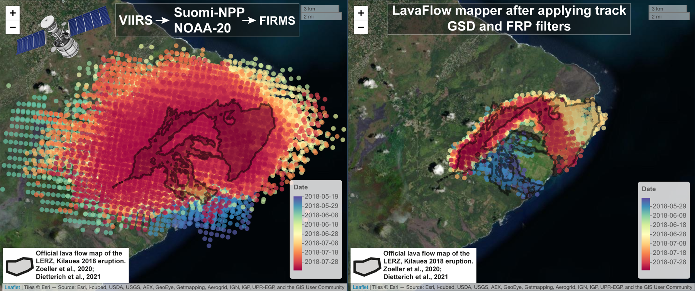

# 🌋 LavaFlow Mapper Suite

**LavaFlow Mapper Suite** is an open-source Python application for the near-real-time
mapping and monitoring of active lava flows from the thermal anomalies distributed by
[NASA FIRMS](https://firms.modaps.eosdis.nasa.gov/) (VIIRS and MODIS).

It implements the methodology of
[Vasconez et al. (2022)](https://doi.org/10.3390/rs14143483) in a single graphical
interface. The suite downloads the data, filters it, maps it, animates it and writes the
reports that volcano observatories need during an effusive crisis.

## What it does

| Tab | Purpose |
|---|---|
| 1. Global Config | Create or select a project: vent, analysis period, filters, optional reference layers |
| 2. FIRMS Download | Download VIIRS (SNPP, NOAA-20, NOAA-21) and MODIS detections with your FIRMS MAP_KEY |
| 3. Anomalies Count | Daily/weekly/monthly detection counts and a period summary |
| 4. FRP Statistics | Cumulative Fire Radiative Power statistics every 12 h |
| 5. LavaFlow Mapper | Filtered anomaly map + FRP and distance-to-vent series (stats follow the zoom) |
| 6. LavaFlow Propagation | Animated flow advance; MP4 rendering |
| 7. Propagation Speed | Maximum runout and advance rate |
| 8. Export Report | Self-contained, responsive HTML report |

## Who is it for?

Volcano observatories, civil-protection agencies, researchers and students who need
lava-flow extent and advance information quickly, especially at remote volcanoes with
little ground-based monitoring.

## Citing

If you use the software, please cite:

> Vasconez F.J., Anzieta J.C., Müller A.V., Bernard B., Ramón P. (2022). A Near Real-Time and
> Free Tool for the Preliminary Mapping of Active Lava Flows during Volcanic Crises: The Case
> of Hotspot Subaerial Eruptions. *Remote Sensing*, 14(14), 3483.
> <https://doi.org/10.3390/rs14143483>

A machine-readable citation is available in
[`CITATION.cff`](https://github.com/Panch021/LavaFlow_Mapper_Suite/blob/main/CITATION.cff).
